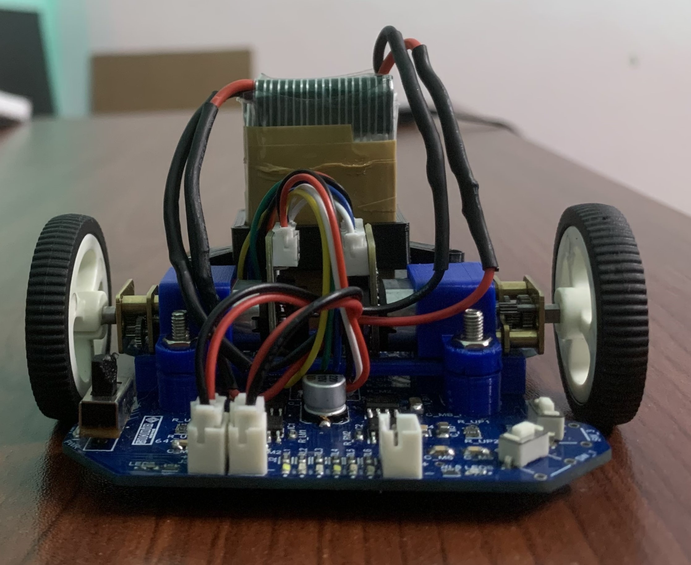
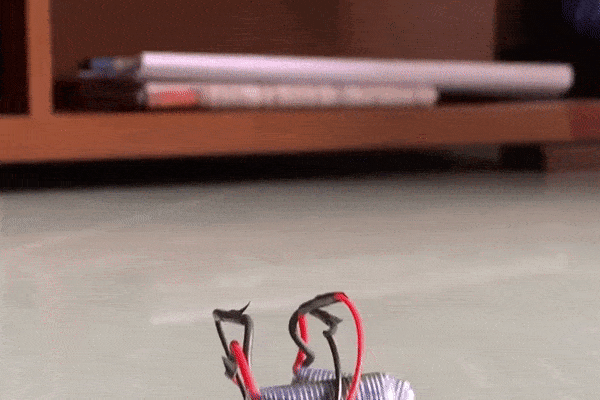

# SINDiB Micromouse Project

Welcome to the repository for the SINDiB Micromouse project developed for RoboFest 2023 by the SINDiB team. In this project, we present our efforts to design and build a micromouse robot capable of navigating a maze autonomously. This README file provides an overview of the design details starting from the rough sketch. We wish to extend our heartfelt gratitude to [Mr. Kithmin Wickremasinghe](https://www.kithminrw.com/  ) for serving as an unwavering source of inspiration and mentorship throughout the entirety of this project

    
    
    

## Component Selection

### Microcontroller: STM32F405

When developing high-speed micro mice, the choice of microcontroller plays a critical role. It's essential to opt for a high-performance microcontroller that also offers sufficient memory capabilities. In our project, we have carefully considered these factors and selected the STM32F405 microcontroller from the STM32 variations. This microcontroller falls within the STM32F2, STM32F4, and STM32F7 families, all of which are known for their high performance. 

The STM32F405 microcontroller stands out due to its potent ARM Cortex-M4 core, generous Flash and RAM resources, and efficient implementation of intricate algorithms for maze-solving and motion control. With up to 15 communication interfaces, two 12-bit DACs, three 12-bit ADCs, and ample EEPROM support, the STM32F405 offers a comprehensive set of features that align well with our project's requirements.

While the ESP32 also presents itself as a viable option with its wireless communication capabilities, which could prove advantageous during debugging, we prioritized the STM32F405 due to its suitability in terms of size requirements. This careful consideration ensures that our micro mouse project maintains the balance between performance and form factor.

### Programming Tool: ST-Link V2
The SWD (Serial Wire Debug) mode of the ST-Link V2 provides an efficient method for debugging and programming microcontroller. With SWD, we can access real-time debugging information, set breakpoints, and upload firmware seamlessly, reducing development time and ensuring precise control over our micromouse's behavior.

### Voltage Regulators: TPS76850, AMS1117, TPS73633
- TPS76850: We've opted for the TPS76850 as a **low dropout voltage** 5V linear regulator to provide a stable power supply for the main components, ensuring reliable operation. (Alternative Option: MIC39101)
- AMS1117: The AMS1117 3.3V linear regulator is selected to power the IR Receiver, providing a clean and regulated voltage source for accurate sensor readings.
- TPS73633: This **low drop voltage** linear regulator is used to power the microcontroller, ensuring a stable and noise-free power source with enough current capablity for high performance.

### Infrared Components: SFH4545 (IR Emitter) and TEFT4300 (IR Receiver)
- SFH4545: The SFH4545 IR emitter stands as our choice for its efficient and focused infrared emission. With a narrow half angle of 5 degrees, it significantly improves the accuracy of our distance measurement and obstacle detection systems. 
- TEFT4300: The TEFT4300 IR Receiver is selected for its sensitivity and reliability in detecting the emitted infrared signals, enabling precise distance measurements.

### Gyroscope: L3GD20HTR
Elevated sensitivity enables the detection of minute angular velocity changes, a pivotal feature for meticulous motion tracking demands. With minimal power consumption, it seamlessly aligns with battery-powered applications, ensuring extended operational endurance. Its compact form factor further enhances its adaptability, effortlessly integrating into various devices and augmenting the efficiency of our micromouse's design.

### Motor: N20-500RPM with Gear Ratio 30:1, 7PPR Encoder

The N20-500RPM motor, paired with a gear box of ratio 30:1, strikes a balance between speed and torque. This combination provides the necessary power to propel the robot through the maze while maintaining control, maneuverability and a low stall current of 0.6A. 7PPR compatible encoder provides 28 Counts Per Revolution(CPR). Compatible D-hole rubber wheel with 32mm diameter and 3mm apecture is selected.
$$\texttt{Speed}_{max}= \frac{500\times 2\pi}{60}\cdot 0.016=0.83ms^{-1}$$
$$\texttt{Accuracy} = \frac{2\pi\times 0.016}{30\times 28}= 1.196\times10^{-4}m/count=0.12mm/count $$

### Motor Drivers: TC4427, ZXMHC3F38148

- TC4427: We've selected the TC4427 motor driver for its fast switching capabilities, ensuring precise control over the motor's speed and direction.
- ZXMHC3F38148: This motor driver complements the TC4427, offering additional motor control options and enhancing overall performance.

### User Interface

- OLED Display: The OLED display serves as an informative interface, displaying relevant data and status information during development and testing phases. Considering high-update speed requirement SPI communication is used to interface with STM32
- Buzzer: We've integrated a buzzer to provide auditory feedback, aiding in debugging and providing alerts for specific events.
- HC-06 Bluetooth Module: The HC-06 module facilitates wireless communication with the micromouse, enabling remote debugging and configuration adjustments.

### Battery
Our micromouse project relies on a series configuration of two Li-ion 3.7V batteries, meticulously chosen to strike a harmonious balance between weight, size, and power supply capability. While our initial preference was for 850mAh batteries to achieve a lightweight and compact design, we opted for 1100mAh batteries with a 25C discharge rate for debugging purposes. This decision not only aligns with our goal of 10 minutes of operation but also offers ample power for efficient debugging while maintaining the project's core attributes.

***See the file [components.xlsx](./components.xlsx) for complete description of components with order details***

## PCB Design

The PCB design is set at dimensions of 98mm by 74mm. This deliberate size choice allows for possible future expansion, including diagonal runs or extra components. The design maintains compatibility with the micromouse challenge's limitations. Furthermore, this sizing aligns with the cost-effective PCB manufacturing boundary of 100mm by 100mm provided by JLCPCB. 
**Design Files** could be viewed [here](./PCB/).

Understand the design bettery by looking at the [schematic](./PCB/Design/schematic.pdf) and [layout](./PCB/Design/layout.pdf).

### Design Considerations
1. **Overlay Labels**: Ensured clear overlay labels, including indicators for the positive side of batteries, components placed within the compact size constraints, and proper naming of SWD interface pins and motor pins.
2. **Ground Separation**: Maintained the separation of motor ground, analog ground, and main ground until the battery terminal. This seperation is also upheld during the copper pouring process. The isolation of motor ground addresses potential signal noise that could impact microcontroller performance. Furthermore, AGND was designated as a noise-free ground for components like the gyroscope and IR receiver, which is particularly sensitive to ground noise.
3. **Trace Widths**: To accommodate high current flow, we implemented a trace width of 30mil. For tracks originating from the microcontroller, an 11mil width was chosen, while a width of 15mil was used for most tracks. Notably, the trace widths for high current paths were tailored for connections involving the battery, motor ground, and motor drivers to the motor header. Clearance values were chosen in accordance with manufacturer capablities.
4. **Copper Pours**: Deliberate copper pours were employed to enhance thermal conductivity, especially for high current paths and integrated circuits. The chosen nets for copper pours encompass battery positive voltage, motor ground, 3V3 STM32 supply, analog ground for the gyroscope, and general ground connections. The selection of pour areas was made with meticulous attention to detail, ensuring optimal performance and functionality.
5. **Symmetric Component Placement**: Our design emphasizes symmetrical placement of components, taking into account the inherent symmetry of the mouse body. This approach extends to the distribution of component placements, ensuring uniform weight distribution across the micromouse.
6. **IR Sensor Guidelines**: To ensure precise alignment of IR sensors, we incorporated accurately aligned guide lines corresponding to specific angular measurements. This meticulous approach guarantees the optimal positioning and performance of the IR sensors. We accomadate two IR configurations by having an extra pad and guideline.

### Design Flow
1. Finishing the Placements and Outer Shape

2. Routing the Design using Different Widths - Keep a rule of thumb!

  
  
  

3. Filling Copper in our Design.

  
  

 
Here is the complete PCB in a 3D view.
 

## Soldering
1. **Power Circuit** : We begin by soldering the power circuit components. Once completed, we use test points to verify the voltage output, comparing it with the expected values.

2. **Main Controller** : Next, we move on to soldering the microcontroller and establish a connection to upload the code. This step allows us to verify the basic functionality of the microcontroller.

3. **Passive Components** : After confirming the proper functioning of the microcontroller, we proceed to solder all other components to complete the circuit. This step ensures that all elements of the project are integrated seamlessly.

***Note***: We paid special attention to soldering the gyroscope, adhering to its footprint specifications to ensure precise and reliable connections. Infact we confirmed the connections from microcontroller end.

    
    
    

        &rarr; <!-- Right arrow entity -->
    

    
    

        &rarr; <!-- Right arrow entity -->
    

    
    

        &rarr; <!-- Right arrow entity -->
    

    

## Firmware

## Achievements
We are proud to announce that our project achieved remarkable success at SLIIT Robofest 2023. We secured the prestigious position of 2nd runners up.

    
    

**Search Run** 

## Basic Tests
1. **TEST 1:** Going straight with the help of encoder 

2. **TEST 2:** Aligning the robot normal to a wall in front on a specified distance. 

3. **TEST 3:** Compass nature using gyroscope reading. 

## Hardware Offer
We are pleased to offer the complete hardware package of our robot along with access to essential codes at an attractive price of 50,000 Sri Lankan Rupees (SLR).

### What's Included

- **Hardware**: You will receive the physical hardware components necessary to assemble and operate the robot. This includes all sensors, actuators, and the microcontroller.

- **Libraries**: Gain access to fundamental hardware control codes that allow you to interact with and control the robot's components. These codes serve as a foundation for further development and customization.

### Why Choose Our Offer

Our goal is to make robotics accessible to everyone. By providing both the hardware and the essential software components, we aim to simplify the process of getting started with robotics projects.

### How to Get Started

To take advantage of this offer and begin your journey into robotics, please [contact us](mailto:shansanjithofficial@gmail.com). We will be happy to assist you in acquiring the hardware and access codes.

Don't miss out on this opportunity to kickstart your robotics projects with a reliable foundation!

## References
1. [STM32-ST Link V2 for programming STM32 microcontrollers.](https://www.robotics-university.com/2016/05/mini-st-linkv2-programming-tool-for-stm8-and-stm32.html)
2. [Interfacing HC-06 bluetooth module via USART communication.](https://www.etechnophiles.com/hc06-pinout-specifications-datasheet/)
3. [Interfacing OLED display via SPI communication.](https://github.com/lamik/OLED_SSD1306_STM32_HAL)
4. 

